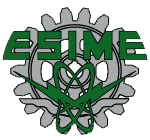
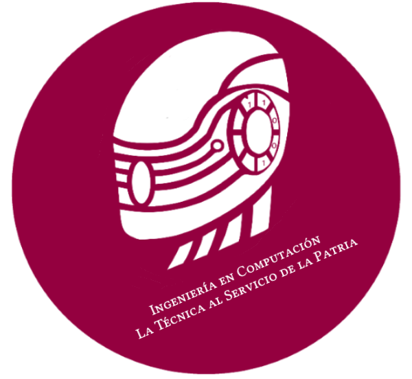

# Programacion Orienteada a Objetos
  
##  - ESIME CULHUACAN - 

Este repositorio tiene como objetivo proporcionar una guía clara y estructurada sobre la aplicación de la Programación Orientada a Objetos (POO) en diversos lenguajes de programación, siguiendo las directrices y prácticas del *[plan de estudios vigente](https://sacadem.esimecu.ipn.mx/public/ic/planes/plan%20de%20estudios.pd)* al que se lee este repositorio, en nuestra institución. Contiene una colección de archivos explicativos y ejercicios prácticos diseñados para facilitar el aprendizaje y la aplicación de los conceptos fundamentales de POO. Estos recursos están orientados no solo a apoyar tu desempeño en las asignaturas de programación, sino también a fortalecer tus habilidades a lo largo de toda tu formación académica en computación.

Te invitamos a clonar este repositorio en tu entorno local para practicar y contribuir con tus observaciones, sugerencias o mejoras. Tu participación es bien recibida y ayudará a enriquecer este recurso compartido.

[POO en Python](Poo-Python)   -   [POO en C++](Poo-C++)

### Aspectos fundamentales que aborda este repositorio:

- **Encapsulamiento:** Cómo proteger los datos dentro de las clases y métodos.
- **Herencia:** Implementación de jerarquías y reutilización de código.
- **Polimorfismo:** La capacidad de las clases para redefinir comportamientos heredados.
- **Abstracción:** Simplificación de conceptos complejos mediante clases y objetos.
- **Ejercicios prácticos:** Problemas reales que te ayudarán a entender la teoría y aplicarla en proyectos futuros.

  
*"La Tecnica al Servicio de la Patria"*

[ESIME CULHUACAN](https://www.esimecu.ipn.mx/)

